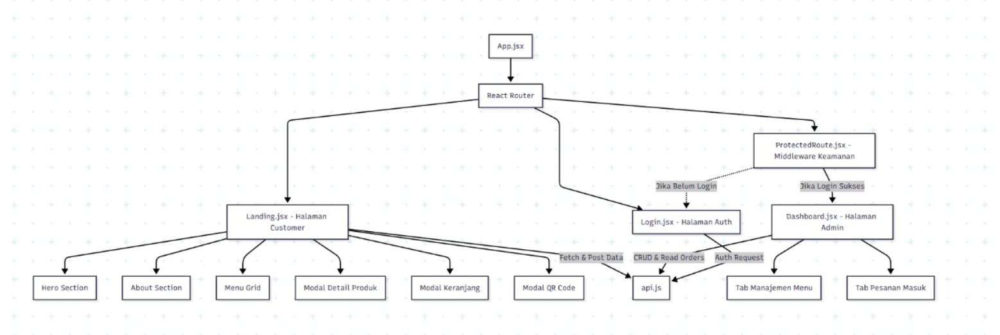

# Aplikasi Inventaris Gudang (Inventory App)

Aplikasi manajemen stok sederhana yang dibangun menggunakan **React (Vite)** dan **JSON Server** sebagai simulasi backend REST API. Aplikasi ini menerapkan operasi CRUD (Create, Read, Update, Delete) lengkap.

## 🛠 Teknologi yang Digunakan
- **Frontend:** React.js + Vite
- **Styling:** Tailwind CSS
- **Backend Simulation:** JSON Server
- **HTTP Client:** Axios

## 📊 Hierarki Komponen

Berikut adalah diagram struktur komponen aplikasi ini:



*Gambar di atas merepresentasikan alur data dari App.jsx ke komponen-komponen kecil.*

## 🚀 Cara Menjalankan Aplikasi

Ikuti langkah-langkah berikut untuk menjalankan aplikasi di komputer lokal:

### 1. Install Dependensi
Buka terminal di folder project dan jalankan:
```bash
npm install
2. Jalankan Server & Aplikasi
Aplikasi ini membutuhkan dua terminal yang berjalan bersamaan (Satu untuk Backend, satu untuk Frontend).

Terminal 1 (Backend - JSON Server):

Bash

npm run server
Server akan berjalan di http://localhost:3000

Terminal 2 (Frontend - React):

Bash

npm run dev
Aplikasi akan berjalan di http://localhost:5173

📝 Fitur
GET: Menampilkan daftar barang dari database.

POST: Menambah barang baru ke inventaris.

PUT: Mengubah data barang (Edit).

DELETE: Menghapus barang dari inventaris.


### Langkah Selanjutnya
Setelah menempelkan kode di atas, jangan lupa jalankan perintah ini di terminal agar perubahan tersimpan dan terkirim ke GitHub:

```bash
git add README.md
git commit -m "Update README dengan diagram visual"
git push origin development